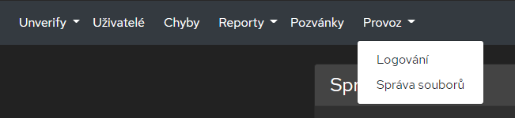

# Správa souborů

Veškeré soubory, které je potřeba prezistentně ukládat, tak se ukládají do databáze. K tomu slouží tabulka [Files](#tabulka-files).

## Schéma databázových tabulek

### Tabulka `Files`

- Sloupec primárního klíče: `Filename`

| Název sloupce  |  Datový typ (.NET)   | Datový typ (SQL) | Nullable | Popis                                                                                                        |
| -------------- | :------------------: | :--------------: | :------: | ------------------------------------------------------------------------------------------------------------ |
| Filename       |        string        |  nvarchar(250)   |    Ne    | Název souboru                                                                                                |
| Content        |        byte[]        |  varbinary(max)  |   Ano    | Binární obsah souboru                                                                                        |
| AuditLogItemId | Nullable&lt;long&gt; |      bigint      |   Ano    | Cizí klíč do tabulky `AuditLogs`. Pokud k záznamu v logu náleží nějaký soubor, tak je zde poznačeno jeho ID. |

## Příkazy pro práci se soubory

*Všechny níže uvedené příkazy počítají s výchozím prefixem `$`. Prefix se může lišit v závislosti na vaší konfiguraci.*

### $files upload

Nahraje soubor do databáze. K souboru nelze přiřadit záznam v Audit Logu. Je možné také nahrát více souborů najednou, stačí aby daná zpráva obsahovala více příloh.

#### Příklad volání

```sh
$files upload
```

a příloha.

### $files list

Vrátí seznam souborů nahraných do databáze. Seznam neobsahuje soubory, které byly nahrány prostřednictvým audit logu.

#### Příklad volání

```sh
$files list
```

### $files get `{filename}`

Vrátí obsah souboru, pokud existuje.

#### Parametry

| Název    | Datový typ | Popis          |
| -------- | :--------: | -------------- |
| filename |   string   | Název souboru. |

#### Příklad volání

```sh
$files get image.jpg
```

### $files remove `{filename}`

Smaže soubor, pokud existuje.

#### Parametry

| Název    | Datový typ | Popis          |
| -------- | :--------: | -------------- |
| filename |   string   | Název souboru. |

#### Příklad volání

```sh
$files remove image.jpg
```

## Webové rozhraní

Správa souborů je také dostupná pomocí webového rozhraní. Tuto sekci lze nalézt v kategorii Provoz. Viz screen obrazovky.



Ve správě souborů webového rozhraní je možné soubory stahovat a mazat.
